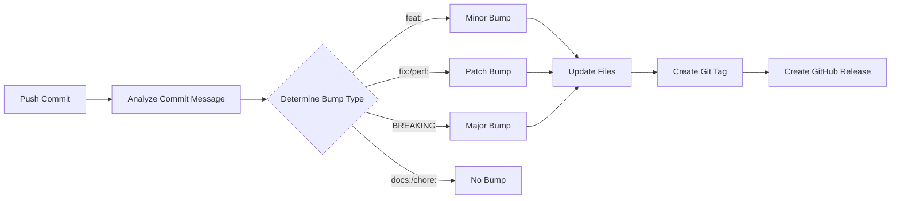

# Semantic Versioning System

This document explains the automated semantic versioning system for the JupyterLab project.

## 📌 Overview

The project uses **Semantic Versioning 2.0.0** with automated version management through:
- **Conventional Commits** for version bump detection
- **Python script** (`scripts/version_manager.py`) for manual version management
- **GitHub Actions** (`.github/workflows/semantic-release.yml`) for automated releases

## 🔢 Version Format

Versions follow the format: **MAJOR.MINOR.PATCH** (e.g., `1.2.3`)

- **MAJOR** (X.0.0): Breaking changes, incompatible API changes
- **MINOR** (0.X.0): New features, backwards-compatible additions
- **PATCH** (0.0.X): Bug fixes, backwards-compatible fixes

## 🚀 How It Works

### 1. Commit Message Triggers

The system analyzes commit messages to determine version bumps:

| Commit Type | Version Bump | Example |
|-------------|--------------|---------|
| `feat:` | **Minor** | `feat: add Redis support` → 0.6.0 → 0.7.0 |
| `fix:` | **Patch** | `fix: resolve auth bug` → 0.6.0 → 0.6.1 |
| `perf:` | **Patch** | `perf: optimize queries` → 0.6.0 → 0.6.1 |
| `refactor:` | **Patch** | `refactor: clean up code` → 0.6.0 → 0.6.1 |
| `feat!:` or `BREAKING CHANGE:` | **Major** | `feat!: new API` → 0.6.0 → 1.0.0 |
| `docs:`, `test:`, `chore:` | **None** | No version change |

### 2. Automated Workflow

When you push to `main` or `develop`:



**Steps:**
1. GitHub Actions detects push
2. Analyzes commit message for conventional commit type
3. Determines version bump (major/minor/patch/none)
4. Runs `version_manager.py` to update:
   - `version.txt` - Current version
   - `README.md` - Version badge
   - `CHANGELOG.md` - New version entry
5. Commits changes with `[skip ci]` to avoid loops
6. Creates Git tag (e.g., `v0.7.0`)
7. Creates GitHub Release:
   - **main branch** → Full release
   - **develop branch** → Pre-release

## 🛠️ Manual Version Management

### Using the Python Script

```bash
# Show current version
python scripts/version_manager.py --current

# Bump versions
python scripts/version_manager.py --bump patch  # 0.6.0 → 0.6.1
python scripts/version_manager.py --bump minor  # 0.6.0 → 0.7.0
python scripts/version_manager.py --bump major  # 0.6.0 → 1.0.0

# Set specific version
python scripts/version_manager.py --set 2.0.0

# Dry run (preview changes without applying)
python scripts/version_manager.py --bump minor --dry-run
```

### What the Script Updates

1. **`version.txt`** - Central version file
   ```
   0.7.0
   ```

2. **`README.md`** - Version badge
   ```markdown
   
   ```

3. **`CHANGELOG.md`** - New version entry
   ```markdown
   ## [v0.7.0] - 2025-10-15
   
   ### Added
   - 
   
   ### Changed
   - 
   ```

### After Manual Bump

```bash
# 1. Review changes
git diff

# 2. Edit CHANGELOG.md to add release notes

# 3. Commit
git add .
git commit -m "chore: bump version to v0.7.0"

# 4. Create tag
git tag -a v0.7.0 -m "Release v0.7.0"

# 5. Push
git push origin develop
git push origin v0.7.0
```

## 🎬 Triggering Manual Release via GitHub

You can manually trigger a release from GitHub Actions:

1. Go to your repository → **Actions** tab
2. Select **Semantic Release** workflow
3. Click **Run workflow** button
4. Choose:
   - **Branch**: `main` or `develop`
   - **Version bump type**: `major`, `minor`, or `patch`
5. Click **Run workflow**

The workflow will automatically bump the version and create a release.

## 📝 Commit Message Best Practices

### Good Examples

```bash
# Feature (minor bump)
git commit -m "feat: add PostgreSQL backup automation"

# Bug fix (patch bump)
git commit -m "fix: resolve token expiration issue"

# Performance improvement (patch bump)
git commit -m "perf: optimize Docker image build time"

# Breaking change (major bump)
git commit -m "feat!: migrate to Python 3.12

BREAKING CHANGE: Minimum Python version is now 3.12.
Users must upgrade their Python installation."

# No version bump
git commit -m "docs: update installation guide"
git commit -m "test: add unit tests for authentication"
git commit -m "chore: update dependencies"
```

### Detailed Format

```
<type>(<scope>): <short summary>

<detailed description>

<footer with breaking changes, issue references>
```

**Example:**
```
feat(docker): add Redis caching layer

- Implemented Redis caching for session management
- Added redis service to docker-compose.yml
- Updated documentation with Redis configuration

Closes #45
```

## 📊 Files in the System

```
JupyterLab/
├── version.txt                          # Current version (0.6.0)
├── CHANGELOG.md                         # Release history
├── CONTRIBUTING.md                      # Contribution guidelines
├── scripts/
│   └── version_manager.py              # Version management script
├── .github/
│   └── workflows/
│       └── semantic-release.yml        # Automated release workflow
└── documentation/
    └── development/
        └── Semantic-Versioning.md      # This file
```

## 🔄 Workflow Examples

### Example 1: Adding a New Feature

```bash
# 1. Create feature branch
git checkout -b feature/redis-caching

# 2. Make changes
# ... code changes ...

# 3. Commit with conventional format
git add .
git commit -m "feat: add Redis caching support"

# 4. Push and create PR
git push origin feature/redis-caching

# 5. After PR is merged to develop:
#    - GitHub Actions automatically bumps version: 0.6.0 → 0.7.0
#    - Creates pre-release v0.7.0
#    - Updates all version files
```

### Example 2: Fixing a Bug

```bash
# 1. Commit fix
git commit -m "fix: resolve authentication timeout issue

Fixed issue where tokens would expire prematurely causing
authentication failures.

Fixes #123"

# 2. Push to develop
git push origin develop

# 3. Automated result:
#    - Version bumped: 0.7.0 → 0.7.1
#    - Pre-release v0.7.1 created
```

### Example 3: Breaking Change

```bash
# 1. Commit with breaking change indicator
git commit -m "feat!: change API authentication method

BREAKING CHANGE: Authentication now requires JWT tokens
instead of simple API keys. Users must update their
client code to use the new authentication flow.

Migration guide: documentation/wiki/JWT-Migration.md"

# 2. Push to main (after PR approval)
git push origin main

# 3. Automated result:
#    - Version bumped: 0.7.1 → 1.0.0
#    - Full release v1.0.0 created
```

## ⚙️ Configuration

### Customizing the Workflow

Edit `.github/workflows/semantic-release.yml` to customize:

- **Branches**: Change which branches trigger releases
- **Commit patterns**: Modify regex for commit message parsing
- **Release notes**: Customize changelog extraction
- **Permissions**: Adjust GitHub token permissions

### Customizing the Script

Edit `scripts/version_manager.py` to customize:

- **Files updated**: Add/remove files to update
- **Version format**: Change version string format
- **Changelog format**: Modify changelog entry template

## 🚫 Preventing Unwanted Releases

The workflow skips execution if:
- Commit message contains `[skip ci]`
- Commit message contains `chore: bump version`
- Commit type doesn't trigger version bump (`docs:`, `test:`, etc.)

## 📚 Additional Resources

- [Semantic Versioning 2.0.0](https://semver.org/)
- [Conventional Commits](https://www.conventionalcommits.org/)
- [Contributing Guide](../../CONTRIBUTING.md)
- [GitHub Actions Documentation](https://docs.github.com/en/actions)

## ❓ Troubleshooting

### Version not bumping automatically?

1. Check commit message follows conventional format
2. Verify GitHub Actions workflow ran successfully
3. Ensure you pushed to `main` or `develop` branch
4. Check workflow logs in GitHub Actions tab

### Manual bump needed?

Use the Python script:
```bash
python scripts/version_manager.py --bump patch
```

### Want to skip CI?

Add `[skip ci]` to commit message:
```bash
git commit -m "docs: update README [skip ci]"
```

---

**Current Version:** v0.6.0  
**Last Updated:** 2025-10-15
